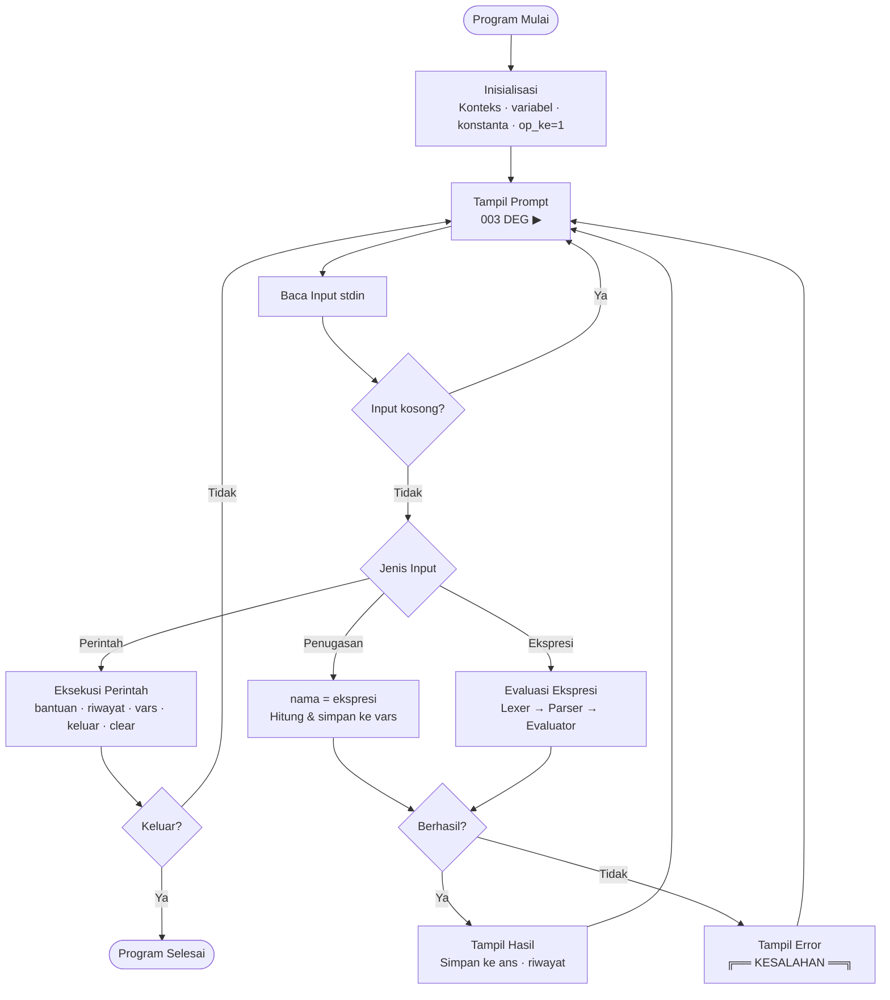
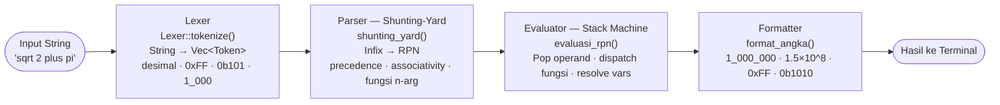
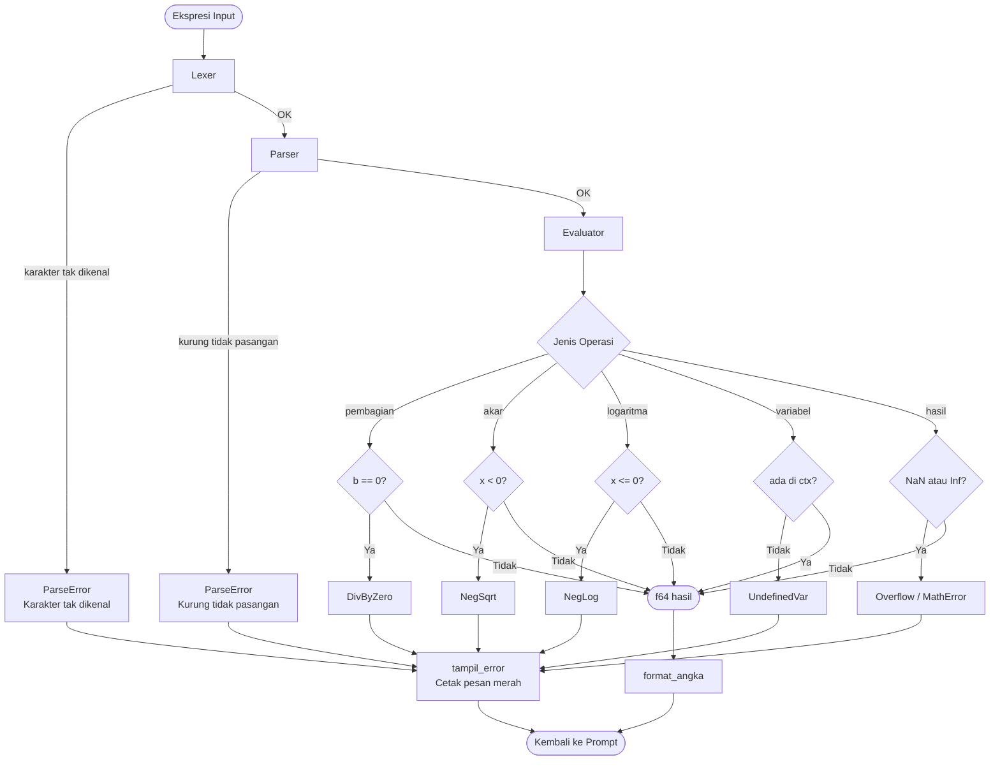
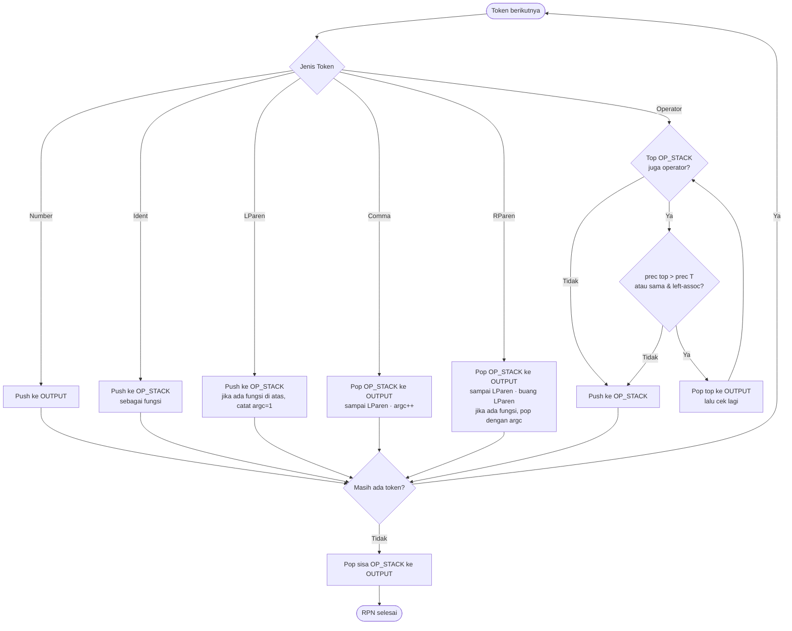

# 🧮 kalkulator

Kalkulator CLI presisi tinggi, ditulis sepenuhnya dalam **Rust**.

[](https://www.rust-lang.org)
[](LICENSE)

---

## Daftar Isi

- [Fitur](#fitur)
- [Instalasi](#instalasi)
- [Cara Pakai](#cara-pakai)
- [Operator](#operator)
- [Fungsi Matematika](#fungsi-matematika)
- [Konstanta](#konstanta)
- [Variabel](#variabel)
- [Perintah Khusus](#perintah-khusus)
- [Flowchart](#flowchart)
- [Arsitektur](#arsitektur)

---

## Fitur

- **Presisi tinggi** — IEEE-754 f64 (15–17 digit signifikan), setara COBOL COMP-3
- **Parser infix penuh** — ekspresi kompleks dengan kurung, precedence, dan associativity
- **45+ fungsi matematika** — akar, log, trig, hiperbolik, kombinatorika, Gamma
- **Variabel sesuka hati** — simpan dan gunakan antar kalkulasi
- **Mode sudut** — Derajat (default) atau Radian, ganti kapan saja
- **Riwayat sesi** — 20 kalkulasi terakhir tersimpan
- **Format output cerdas** — separator ribuan, notasi ilmiah, biner/hex/oktal
- **Input fleksibel** — hex `0xFF`, biner `0b1010`, separator `1_000_000`

---

## Instalasi

```bash
# Install Rust (jika belum ada)
curl --proto '=https' --tlsv1.2 -sSf https://sh.rustup.rs | sh

# Clone dan build
git clone https://github.com/risqinf/kalkulator
cd kalkulator
cargo build --release

# Jalankan
./target/release/kalkulator
# atau langsung
cargo run --release
```

---

## Cara Pakai

Ketik ekspresi matematika, tekan `Enter`.

```
  [001|DEG] ▶  sqrt(2) * pi

  ┌─ Hasil #1  [DEG] ──────────────────────────────
  │
  │  ekspresi: sqrt(2) * pi
  │
  │  hasil   : 4.442882938158366
  └────────────────────────────────────────────────
```

Urutan operasi PEMDAS/BODMAS diterapkan otomatis.

---

## Operator

```
+        penjumlahan           5 + 3       → 8
-        pengurangan           10 - 4      → 6
*        perkalian             6 * 7       → 42
/        pembagian             10 / 4      → 2.5
^        pangkat               2 ^ 10      → 1_024
**       pangkat (alias ^)     2 ** 10     → 1_024
%        modulo                17 % 5      → 2
//       pembagian bulat bawah 17 // 5     → 3
n!       faktorial (postfix)   7!          → 5_040
()       kurung                (2+3) * 4   → 20
-x       unary minus           -5 + 3      → -2
```

Prioritas operator (tinggi ke rendah): `!` › `^ **` › `* / // %` › `+ -`

---

## Fungsi Matematika

### Akar & Eksponen

```
sqrt(x)        akar kuadrat                sqrt(144)      → 12
cbrt(x)        akar kubik                  cbrt(27)       → 3
root(x, n)     akar ke-n                   root(32, 5)    → 2
sq(x)          kuadrat x²                  sq(9)          → 81
cube(x)        pangkat tiga x³             cube(3)        → 27
exp(x)         e pangkat x                 exp(1)         → 2.71828...
exp2(x)        2 pangkat x                 exp2(8)        → 256
pow(a, b)      a pangkat b                 pow(2, 10)     → 1024
```

### Logaritma

```
ln(x)          logaritma natural (basis e) ln(e)          → 1
log(x)         logaritma basis 10          log(1000)      → 3
log2(x)        logaritma basis 2           log2(1024)     → 10
logn(x, b)     logaritma basis b           logn(8, 2)     → 3
```

### Trigonometri

> Input dalam **derajat** secara default. Ketik `/radian` untuk ganti mode.

```
sin(x)         sinus
cos(x)         kosinus
tan(x)         tangen
cot(x)         kotangen
sec(x)         sekan
csc(x)         kosekan
asin(x)        arcsin  — output dalam satuan aktif
acos(x)        arccos
atan(x)        arctan
atan2(y, x)    arctan dua argumen
rad(x)         konversi derajat → radian
deg(x)         konversi radian → derajat
```

### Hiperbolik

```
sinh(x)  cosh(x)  tanh(x)         hiperbolik dasar
asinh(x) acosh(x) atanh(x)        invers hiperbolik
```

### Pembulatan & Utilitas

```
abs(x)         nilai mutlak        abs(-7)        → 7
floor(x)       bulat ke bawah      floor(3.9)     → 3
ceil(x)        bulat ke atas       ceil(3.1)      → 4
round(x)       bulat terdekat      round(3.5)     → 4
trunc(x)       potong desimal      trunc(3.9)     → 3
frac(x)        bagian desimal      frac(3.14)     → 0.14
sign(x)        tanda bilangan      sign(-9)       → -1
inv(x)         resiprokal 1/x      inv(4)         → 0.25
```

### Matematika Lanjutan

```
gcd(a, b)      FPB                 gcd(48, 36)    → 12
lcm(a, b)      KPK                 lcm(4, 6)      → 12
hypot(a, b)    hipotenusa √(a²+b²) hypot(3, 4)    → 5
max(a, b)      nilai maksimum      max(3, 7)      → 7
min(a, b)      nilai minimum       min(3, 7)      → 3
clamp(x,lo,hi) batasi nilai        clamp(15,0,10) → 10
lerp(a, b, t)  interpolasi linear  lerp(0,100,.3) → 30
```

### Kombinatorika

```
fak(n)         faktorial           fak(10)        → 3_628_800
nkr(n, r)      kombinasi C(n,r)    nkr(10, 3)     → 120
npr(n, r)      permutasi P(n,r)    npr(5, 2)      → 20
gamma(x)       fungsi Gamma Γ(x)   gamma(5)       → 24
```

---

## Konstanta

```
pi      3.141592653589793   π
e       2.718281828459045   bilangan Euler
phi     1.618033988749895   rasio emas φ
tau     6.283185307179586   τ = 2π
sqrt2   1.4142135623730951  √2
ln2     0.6931471805599453  ln(2)
ln10    2.302585092994046   ln(10)
eps     2.22e-16            epsilon mesin f64
inf     ∞                   tak hingga
```

---

## Variabel

Definisikan dengan `nama = ekspresi`, lalu gunakan di kalkulasi berikutnya.

```
  [001|DEG] ▶  r = 5
  ✓  variabel 'r' = 5

  [002|DEG] ▶  pi * r^2
  hasil: 78.53981633974483

  [003|DEG] ▶  ans * 2
  hasil: 157.07963267948966
```

`ans` selalu menyimpan hasil terakhir secara otomatis.

Lihat semua variabel: ketik `vars`

---

## Perintah Khusus

```
bantuan    (help, ?)       panduan lengkap di terminal
riwayat    (r, history)    lihat 20 kalkulasi terakhir
vars       (variabel)      lihat semua variabel tersimpan
bersih     (clear, cls)    bersihkan layar
/radian    (radian)        ganti mode sudut ke radian
/derajat   (derajat)       ganti mode sudut ke derajat
keluar     (exit, q)       keluar dari program
```

---

## Flowchart

### Alur Program Utama



### Pipeline Pemrosesan Ekspresi



### Penanganan Error



### Algoritma Shunting-Yard



---

## Arsitektur

```
kalkulator/
├── Cargo.toml
├── README.md
└── src/
    └── main.rs          1160+ baris, satu file tanpa dependensi eksternal

Komponen utama di main.rs:

  Token (enum pub)       Unit leksikal: Number, Ident, Op, LParen, RParen, Comma
  KalError (enum)        Semua jenis error: ParseError, MathError, DivByZero, dll
  Lexer (struct)         Tokenizer: string → Vec<Token>  — mendukung hex/biner/eksponen
  shunting_yard()        Parser: infix → RPN dengan Shunting-Yard (Dijkstra 1961)
  evaluasi_rpn()         Evaluator: stack machine atas RPN
  eval_func()            Dispatcher 45+ fungsi matematika
  Konteks (struct)       State: HashMap variabel + mode sudut (DEG/RAD)
  hitung()               Pipeline utama: string → f64
  format_angka()         Format output: ribuan/ilmiah/biner/hex
  tampil_*()             Fungsi UI terminal berwarna ANSI
  main()                 REPL loop utama
```

---

## Contoh Sesi

```
  [001|DEG] ▶  (1 + sqrt(5)) / 2
  hasil: 1.618033988749895           ← rasio emas φ

  [002|DEG] ▶  fak(20)
  hasil: 2_432_902_008_176_640_000

  [003|DEG] ▶  sin(30)
  hasil: 0.5                         ← mode derajat

  [004|DEG] ▶  nkr(52, 5)
  hasil: 2_598_960                   ← kombinasi 5 kartu dari 52

  [005|DEG] ▶  x = 1e-9
  ✓  variabel 'x' = 1e-9

  [006|DEG] ▶  ln(1 + x) / x
  hasil: 0.9999999995

  [007|DEG] ▶  0xFF + 0b1010
  hasil: 265

  [008|DEG] ▶  hypot(3, 4)
  hasil: 5

  [009|DEG] ▶  gcd(1071, 462)
  hasil: 21

  [010|DEG] ▶  2^32
  hasil: 4_294_967_296
```

---

## Lisensi

MIT © [risqinf](https://github.com/risqinf)
